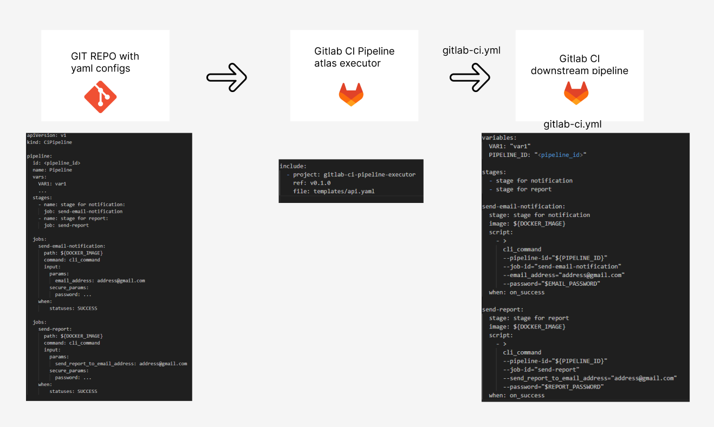

### User Flow:

Девелоперы пишу cli комманды, пишут экзекьютор

Обычные юзеры (аналитики, разрабы и тд) пишут имя комманды и параметры которые хотят использовать [документе по дизайну](../contracts/CiPipeline.md)




## Основные пайплайн сущности, как они декларируются:

### Pipeline:

```
pipeline:
  id: <pipeline_id>
  name: Pipeline
```

### Stage: 

```
stages:
  - name: stage for notification:
    job: send-email-notification
  - name: stage for report:
    job: send-report
```

### Job:
```
jobs:
  send-email-notification:
    path: ${DOCKER_IMAGE}
    command: cli_command
    input:
      params:
        email_address: address@gmail.com
      secure_params:
        password: ${EMAIL_PASSWORD}
    when:
      statuses: SUCCESS
```

### Step:

Степы не декларируются. Вся логика в клишках. в этом и самая суть, что чтобы писать пайплайны можно вообще не уметь программировать и не надо писать логику

### Conditions / when

when:
  statuses: SUCCESS       
  branches: [ main, dev ] 
  manual: false

### Artifacts:

Логика выводом артифактов должна быть в самих клишках, а уже декларации явно указываем, что нужно что то вернуть как артифкат
```
output: 
  HTML_REPORT: report.html
  MD_REPORT: report.md
```