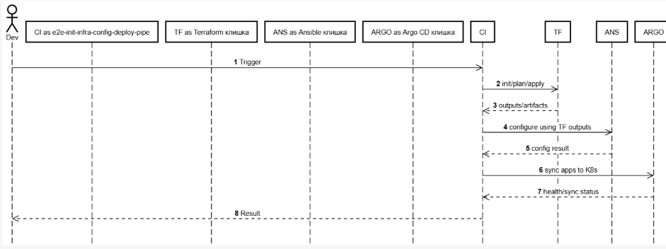

# e2e-init-infra-config-deploy-pipeline

Это пайплайн который создает инфру с нуля. Создает инфру в клауде, потом конфигурит ее, создает кластер кубера через ансибл, и деплоит приложения из арги. 

